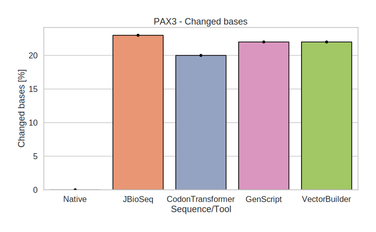
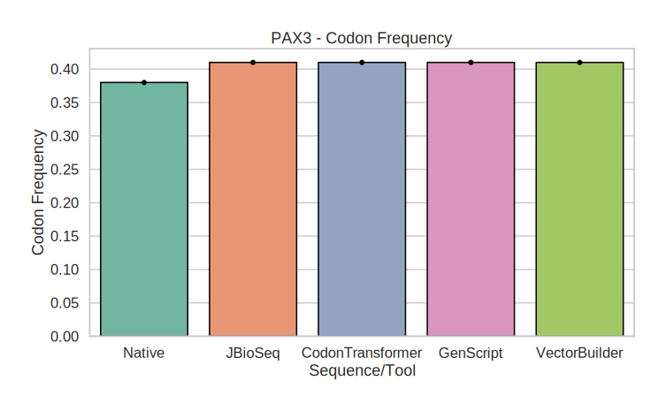
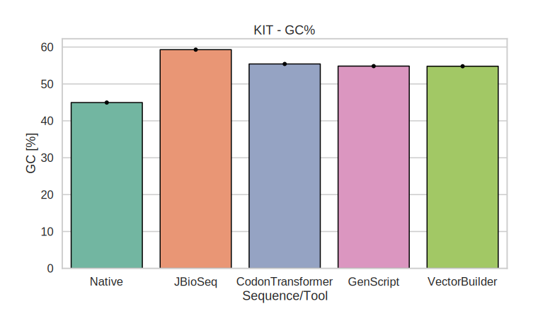
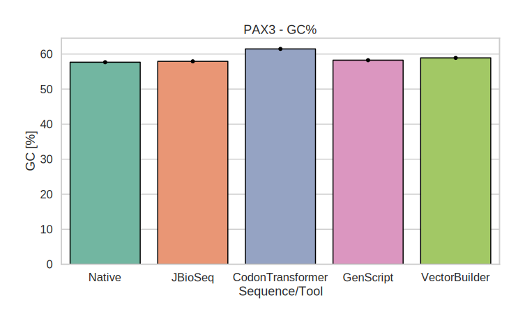
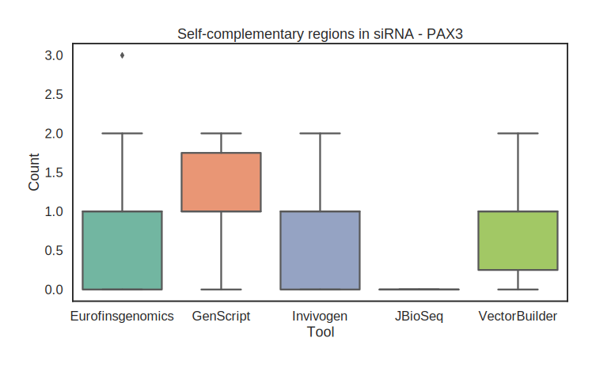
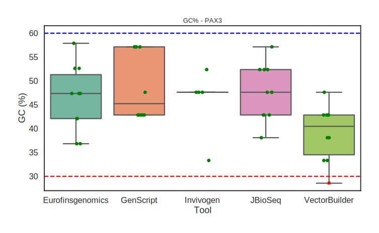
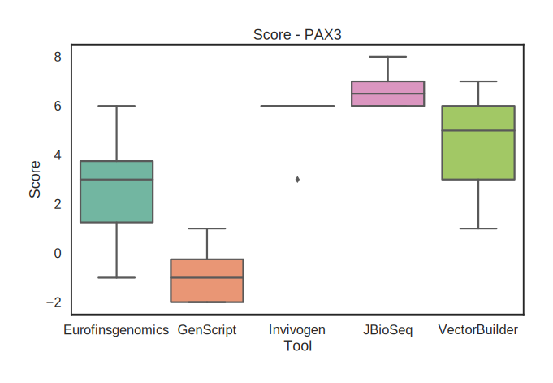

\


```{r include=FALSE, echo=FALSE, warning=FALSE, message=FALSE}

data <- readxl::read_excel('../data/opt_results.xlsx')


```


```{r include=FALSE, echo=FALSE, warning=FALSE, message=FALSE}

data2 <- readxl::read_excel('../data/bench.xlsx')

data2_KIT <- readxl::read_excel('../data/siRNA_bench/mutual_KIT.xlsx')
data2_PAX <- readxl::read_excel('../data/siRNA_bench/mutual_PAX3.xlsx')


```


### Benchmark sequence sources:

```{r echo=FALSE, message=FALSE, warning=FALSE, results='asis'}
library(tidyverse)

links <- data[,c('tool','source')]
links <- links[links$tool %in% 'Native',]
links <- distinct(links)
links$tool <- c('KIT', 'PAX3')

for (i in seq_len(nrow(links))) {
  cat(sprintf("- [%s](%s)\n", links$tool[i], links$source[i]))
}

```

\


# Codon Optimization


### Benchmarked codon optimization tool sources:

```{r echo=FALSE, message=FALSE, warning=FALSE, results='asis'}
library(tidyverse)

links <- data[,c('tool','source')]
links <- links[!links$tool %in% 'Native',]
links <- distinct(links)

for (i in seq_len(nrow(links))) {
  cat(sprintf("- [%s](%s)\n", links$tool[i], links$source[i]))
}

```
\


\

### Optimization statistics


```{r echo=FALSE, message=FALSE, warning=FALSE, results='asis'}
library(tidyverse)

df <- data[,c('tool','gene', 'GC', 'freq', 'changed_bases %' , 'changed_codons %', 'MFE [kcal/mol]')]

DT::datatable(df)

```


\


### Optimized bases [%]


```{r out.width="60%", fig.align='center', include=TRUE, echo=FALSE, warning=FALSE, message=FALSE}




```


\


### Optimized codons [%]


```{r out.width="60%", fig.align='center', include=TRUE, echo=FALSE, warning=FALSE, message=FALSE}


```


\


### Sequences codons frequence 

***related to in vivo / in vitro codon frequency information***


```{r out.width="60%", fig.align='center', include=TRUE, echo=FALSE, warning=FALSE, message=FALSE}




```


\


### Sequences GC content [%]


```{r out.width="60%", fig.align='center', include=TRUE, echo=FALSE, warning=FALSE, message=FALSE}




```


\


### Sequences MFE


```{r out.width="60%", fig.align='center', include=TRUE, echo=FALSE, warning=FALSE, message=FALSE}


```

\


### MFE relative delta between optimized and native sequences


```{r out.width="60%", fig.align='center', include=TRUE, echo=FALSE, warning=FALSE, message=FALSE}

knitr::include_graphics("../fig/KIT_optimization_deltaMEF.svg")


```

\


### Relation - MFE ~ GC%


```{r out.width="60%", fig.align='center', include=TRUE, echo=FALSE, warning=FALSE, message=FALSE}

knitr::include_graphics("../fig/KIT_optimization_MEF_GC.svg")


```


\

### Heatmap of longest consecutive A/C/T/G tracts in the sequences


```{r out.width="60%", fig.align='center', include=TRUE, echo=FALSE, warning=FALSE, message=FALSE}


```


\


\

# RNAi (siRNA/shRNA) prediction


### Benchmarked RNAi prediction tool sources:

```{r echo=FALSE, message=FALSE, warning=FALSE, results='asis'}
library(tidyverse)

links <- data2[,c('Tool','Source', 'Note')]
links <- links[links$Note %in% 'Working',]
links <- distinct(links)

for (i in seq_len(nrow(links))) {
  cat(sprintf("- [%s](%s)\n", links$Tool[i], links$Source[i]))
}

```

\

### RNAi (siRNA/shRNA) statistics

#### KIT

```{r echo=FALSE, message=FALSE, warning=FALSE, results='asis'}
library(tidyverse)

df <- data2_KIT[,c('source', 
                   'RNAi_seq', 
                   'specificity', 
                   'GC%', 
                   'complemenatry_regions',
                   'score',
                   'side')]

DT::datatable(df)

```

\

#### PAX3

```{r echo=FALSE, message=FALSE, warning=FALSE, results='asis'}
library(tidyverse)

df <- data2_PAX[,c('source', 
                   'RNAi_seq', 
                   'specificity', 
                   'GC%', 
                   'complemenatry_regions',
                   'score',
                   'side')]

DT::datatable(df)

```

\

### Self-complementary regions


```{r out.width="60%", fig.align='center', include=TRUE, echo=FALSE, warning=FALSE, message=FALSE}




```


\

### GC content [%]


```{r out.width="60%", fig.align='center', include=TRUE, echo=FALSE, warning=FALSE, message=FALSE}




```

\

### Nucleotide positions score


```{r out.width="60%", fig.align='center', include=TRUE, echo=FALSE, warning=FALSE, message=FALSE}




```

***Scoring based on series of publications:***

- [DOI:10.1093/nar/gkn902](https://doi.org/10.1093/nar/gkn902)
- [DOI:10.1093/nar/gkh247](https://doi.org/10.1093/nar/gkh247)
- [DOI:10.1038/nbt936](https://doi.org/10.1038/nbt936)
- [DOI:10.1016/j.bbrc.2004.02.157](https://doi.org/10.1016/j.bbrc.2004.02.157)


\

### Score ~ GC [%]


```{r out.width="60%", fig.align='center', include=TRUE, echo=FALSE, warning=FALSE, message=FALSE}


```


\

\


##### **Disclaimer**

```{r echo=FALSE, message=FALSE, warning=FALSE, results='asis'}
cat('
The analysis was conducted using the **non-profit pipelines** [JBioSeqTools](https://github.com/jkubis96/JBioSeqTools) and custom [scripts](https://github.com/jkubis96/JBioSeq_benchmark/tree/main/scripts) developed by **Jakub Kubiś**.  

For more information, please contact: **[jbiosystem@gmail.com](mailto:jbiosystem@gmail.com)** 
')
```

\
\


